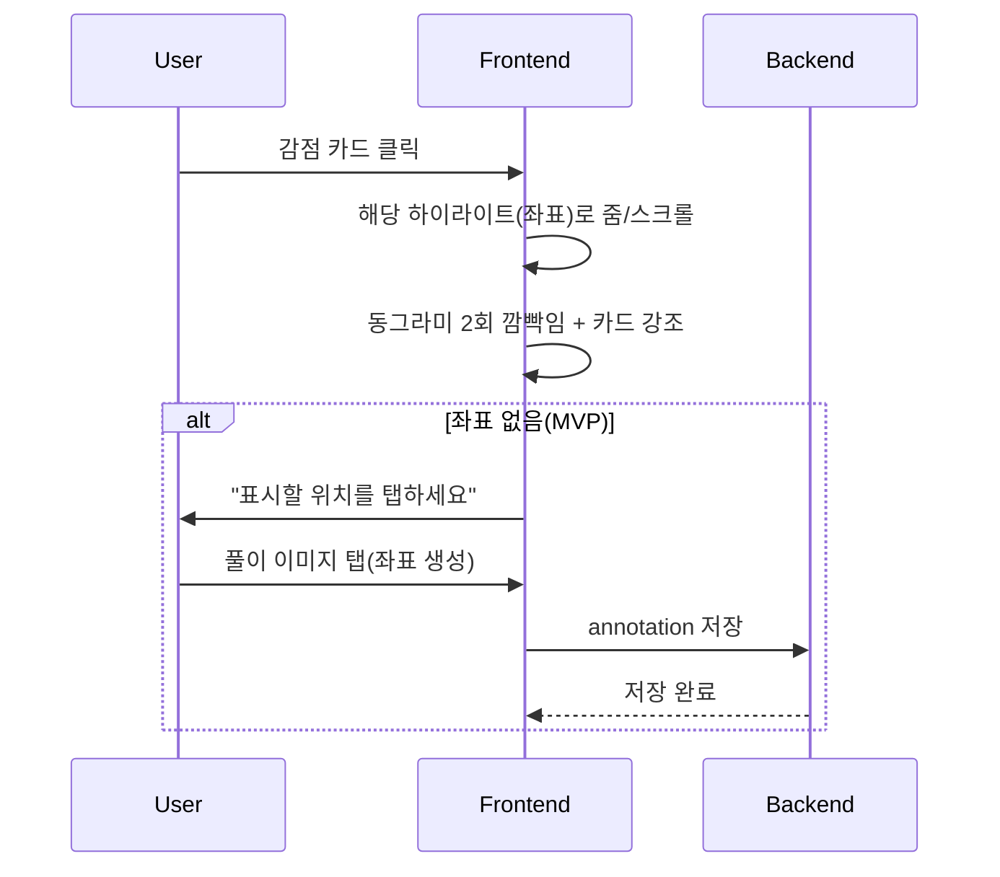
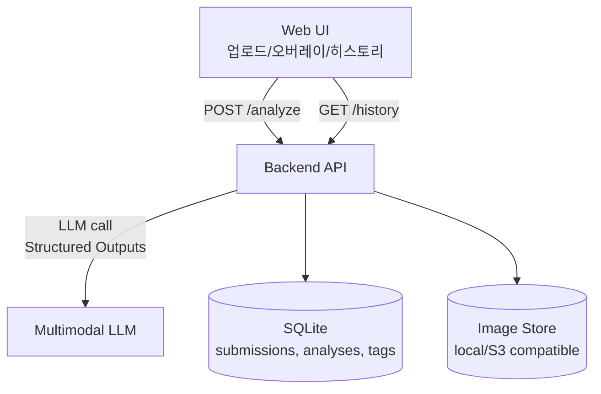

# 최종계획서: 채점형 오답노트 MistakePatch

## Executive Summary
MistakePatch는 **학생이 직접 작성한 풀이 사진을 1~2장 업로드하면**, AI가 **채점 기준표(루브릭)**에 따라 **감점 이유를 구조화해 제시**하고, **정답 전체 해설 대신 “최소 수정 패치(이 부분만 고치면 됨)”**를 제안하며, 실수 유형을 누적해 **개인 약점 대시보드**로 보여주는 **채점형 오답노트**이다. 경쟁 제품(콴다·Photomath·Mathway)이 “문제 촬영 → 정답/단계 해설 제공” 중심이라면, MistakePatch는 “**내 풀이를 평가/감점 → 재발 방지**”에 초점을 둔다(콴다는 ‘풀이 첨삭’과 ‘AI 문제풀이’ 등 다양한 학습 기능을 제공한다고 명시). citeturn3view0turn0search4turn2search0turn2search1

해커톤(48시간·2인)에서의 승부 포인트는 **데모 임팩트**와 **구현 안정성**이다. MLH 기준으로도 심사 과정은 “팀이 심사위원 앞에서 프로젝트를 직접 데모하고 질문을 받는 방식”이 일반적이므로, MistakePatch는 **오버레이 하이라이트(동그라미/박스) + 점수/감점 카드 + 패치(diff) 화면**을 핵심 데모로 설계한다. citeturn5search0turn5search5 또한 구조화 출력(JSON Schema)을 사용해 결과 포맷을 강제하여(키 누락/enum 오류/형식 붕괴) 데모 실패 확률을 낮춘다. citeturn6search2turn1search1turn1search19

---

## 제품 전략과 경쟁 분석
**제품 개요(한 문장)**  
**“문제/내 풀이 사진을 올리면 AI가 루브릭으로 감점 포인트를 시각적으로 표시하고, 최소수정 패치와 실수패턴 대시보드를 생성하는 채점형 오답노트.”**

**문제 정의(학생의 실제 페인포인트)**  
첫째, 학생은 정답/해설을 봐도 **‘내 풀이의 어느 줄이 왜 감점인지’**를 모르기 때문에 같은 유형(조건 누락, 부호, 단위, 논리 점프)을 반복한다. 둘째, 교사/멘토의 채점 피드백은 시간 비용이 커서 **줄 단위 피드백을 상시로 받기 어렵다**. 셋째, 기존 “카메라 풀이” 앱은 편하지만 과제/시험 상황에서 “정답을 바로 보는 습관”을 강화할 수 있어, 학습 도구로서 **부정행위(cheating) 오해** 리스크가 있다(해커톤에서도 공정성 이슈는 심사/운영 측 체크 대상). citeturn6search0turn6search8turn3view0

**경쟁 제품 대비 차별점(핵심 포지셔닝)**  
경쟁 제품들은 “문제 촬영 → 단계별 풀이/정답 제공”을 전면에 둔다(Photomath는 카메라로 스캔해 단계별 설명을 보여준다고 안내, Mathway도 단계별 풀이를 제공). citeturn2search18turn2search1turn2search8 MistakePatch는 **정답 제공이 아니라 ‘감점/패치’**를 기본값으로 두어 학습 도구로의 정체성을 강화한다.

| 항목 | 콴다(QANDA) | Photomath | Mathway | MistakePatch(제안) |
|---|---|---|---|---|
| 기본 흐름 | 문제/풀이 업로드 → 맞춤 풀이/기능 | 카메라 스캔 → 단계 풀이 | 촬영/입력 → 단계 풀이 | **내 풀이 업로드 → 채점/감점/패치** |
| “내 풀이 평가” | ‘풀이 첨삭’ 기능을 명시 citeturn3view0 | 주로 정답/설명 중심 citeturn2search18turn2search14 | 정답/설명 중심 citeturn2search8turn2search1 | **루브릭 점수 + 감점 사유 + 패치(diff)** |
| 시각적 피드백 | (제품 내 구현은 공개 범위 제한) | (정답/설명 위주) | (정답/설명 위주) | **오버레이 하이라이트(동그라미/박스) + 클릭 시 확대/깜빡임** |
| 학습 윤리 리스크 | 정답/해설 즉시 제공 인식 가능 citeturn3view0 | 동일 citeturn2search18turn2search0 | 동일 citeturn2search1turn2search8 | **기본값: 정답 전체 대신 ‘최소 수정’ + 재도전 모드** |

---

## 기능·UX 설계
**핵심 기능 목록(우선순위: 데모 임팩트·구현 현실성·입력 마찰 최소화)**  

| 구분 | 기능 | 사용자 가치 | 데모 임팩트 | 구현 난이도(48h) |
|---|---|---|---|---|
| MVP | 사진 업로드(풀이 1장 필수, 문제 1장 선택) | 입력 최소화(1~2장) | 중 | 하 |
| MVP | 루브릭 채점(총점+항목별 점수) | “왜 감점인지” 구조화 | 중 | 중 |
| MVP | 감점 카드(유형/감점/근거/수정지시) | 즉시 이해·수정 | 중 | 중 |
| MVP | **하이라이트 오버레이(동그라미/박스)** | ‘어디가 틀렸는지’ 직관화 | **상** | 하~중 |
| MVP | 최소수정 패치(diff) | “이 줄만 고치면 됨” | **상** | 중 |
| MVP | 히스토리 저장(최근 N개) | 오답노트화 | 중 | 하 |
| 선택 | 실수 태그 TOP3 대시보드 | 약점 인식 | 중 | 하 |
| 선택 | 재도전 모드(힌트→재업로드→점수상승) | 학습 루프 | 상 | 중 |
| 향후 | OCR 기반 자동 하이라이트 | 완전 자동화 | 상 | 상 |
| 향후 | 과목별 루브릭/단원 템플릿 | 정확도 향상 | 중 | 중 |

**화면 흐름(업로드→채점→하이라이트→히스토리)**  

```mermaid
flowchart LR
A[업로드/촬영\n풀이 1장(필수)\n문제 1장(옵션)] --> B[채점 결과\n총점/항목점수]
B --> C[감점 포인트 탭\n카드 리스트]
B --> D[패치 탭\n최소수정 diff + 수정된 풀이]
C --> E[하이라이트 오버레이\n(동그라미/박스)]
E --> F[히스토리\n오답 카드 목록]
F --> B
```

**와이어프레임 스케치(텍스트)**  

```text
[Screen 1: 업로드]
┌─────────────────────────────┐
│ MistakePatch                 │
│ [풀이 사진 추가] (필수)       │
│ [문제 사진 추가] (선택)       │
│ 과목: (수학/물리)  난이도: (중/상)│
│ [채점하기]                    │
└─────────────────────────────┘

[Screen 2: 결과]
┌─────────────────────────────┐
│ 점수 7.5/10  "조건 누락 위험" │
│ 탭: [감점포인트] [패치] [체크리스트]│
│ (풀이 이미지 + 오버레이)       │
│ 감점 카드 클릭 → 해당 위치 깜빡임 │
└─────────────────────────────┘

[Screen 3: 히스토리/약점]
┌─────────────────────────────┐
│ 최근 기록                     │
│ 02/15 물리 6.0/10  #단위오류   │
│ 02/15 수학 8.0/10  #부호실수   │
│ 실수 TOP3 막대그래프           │
└─────────────────────────────┘
```

**하이라이트 전략(3단계)과 UI 동작**  
텍스트/수식 자동 좌표 매칭은 실패 확률이 있어, MVP는 “확실히 성공하는” 방식부터 시작한다. (ML Kit는 블록/라인/요소별 경계상자·신뢰도·회전정보를 반환해 OCR 기반 좌표화가 가능하고, Apple Vision도 bounding box로 텍스트 위치 시각화를 지원한다. 다만 Apple은 bounding box가 문자에 완벽히 딱 맞지 않을 수 있어 UI 가이드 용도로 쓰라고 명시한다.) citeturn2search3turn4search3turn6search3turn0search1

| 단계 | 방식 | 장점 | 단점 | 해커톤 권장도 |
|---|---|---|---|---|
| 1 | **사용자 탭 하이라이트(MVP)**: 감점 카드→사용자가 풀이 이미지에서 1회 탭→동그라미 저장 | 정확·안정·빠름 | 완전 자동 아님 | **최상** |
| 2 | OCR 자동(선택): ML Kit/Tesseract/Vision이 준 bounding box 중 매칭 | “자동 동그라미” 데모 가능 | 손글씨/수식 OCR 난이도 | 중 |
| 3 | 영역 감지(향후): OpenCV contour/텍스트 영역 검출로 수식 덩어리 박스 | 손글씨에도 어느 정도 | 튜닝 필요 | 하~중 citeturn4search1turn4search4turn4search0 |

**하이라이트 UI 동작(클릭 시 확대/깜빡임)**  



---

## 평가 기준과 AI 설계
**루브릭(공통 템플릿, 10점 만점)**  
- 조건/가정 명시(2): 문제 조건을 옮기고 필요한 가정을 적었는가  
- 모델링/식 세움(2): 핵심 식(정의/법칙/공식) 선택이 타당한가  
- 전개 논리(2): 중간 단계가 논리적으로 연결되는가(논리 점프/케이스 누락)  
- 계산/부호/단위(2): 대수 전개, 부호, 단위 일관성이 있는가  
- 최종 답(2): 답 형태·단위·검산/타당성 체크가 있는가  

**실수 태그 목록(고정 enum; 대시보드와 재발 방지 체크리스트의 기반)**  
CONDITION_MISSED, SIGN_ERROR, UNIT_ERROR, DEFINITION_CONFUSION, ALGEBRA_ERROR, LOGIC_GAP, CASE_MISS, GRAPH_MISREAD, ARITHMETIC_ERROR, FINAL_FORM_ERROR

**AI 프롬프트 초안(멀티모달 + 구조화 출력)**  
구조화 출력은 JSON Schema를 제공해 모델 응답의 키/타입/enum을 강제하는 방식이 안정적이며, 누락 키나 잘못된 enum을 줄여 앱 로직을 단순화한다. citeturn6search2turn1search1turn1search8turn1search0

- **입력(개념)**:  
  - images: solution_image(필수), problem_image(옵션)  
  - meta: subject, grade_level(optional), desired_strictness(“mvp”), highlight_mode(“tap”)  
- **출력(개념)**: rubric_scores, mistakes[], patch(minimal_changes), next_checklist[], confidence

**프롬프트(요약본, 시스템/유저 메시지 형태)**  

```text
[System]
너는 수학/물리 "채점 보조"다. 정답을 길게 풀어주기보다,
(1) 루브릭 기반 점수,
(2) 감점 사유(증거 포함),
(3) 최소 수정 패치(minimal changes),
(4) 재발 방지 체크리스트
를 생성한다. 출력은 반드시 지정된 JSON Schema를 따른다.
이미지가 불명확하면 confidence를 낮추고 missing_info에 필요한 추가사진/정보를 적어라.

[User]
과목=수학, 모드=tap-highlight.
첨부된 것은 학생의 풀이 이미지(필수)와 문제 이미지(선택)이다.
루브릭(10점)으로 채점하고 감점 포인트를 mistakes 배열로 반환해라.
패치는 "최소 수정"만 제시하라(정답 전체 해설 금지).
```

**JSON 스키마(핵심; MVP용)**  
(구현 시 OpenAI 등 Structured Outputs가 JSON Schema를 직접 받는 형태를 가정. citeturn1search19turn1search4turn6search2)

```json
{
  "type": "object",
  "required": ["score_total", "rubric_scores", "mistakes", "patch", "next_checklist", "confidence"],
  "properties": {
    "score_total": { "type": "number", "minimum": 0, "maximum": 10 },
    "rubric_scores": {
      "type": "object",
      "required": ["conditions", "modeling", "logic", "calculation", "final"],
      "properties": {
        "conditions": { "type": "number", "minimum": 0, "maximum": 2 },
        "modeling": { "type": "number", "minimum": 0, "maximum": 2 },
        "logic": { "type": "number", "minimum": 0, "maximum": 2 },
        "calculation": { "type": "number", "minimum": 0, "maximum": 2 },
        "final": { "type": "number", "minimum": 0, "maximum": 2 }
      }
    },
    "mistakes": {
      "type": "array",
      "items": {
        "type": "object",
        "required": ["type", "severity", "points_deducted", "evidence", "fix_instruction", "location_hint"],
        "properties": {
          "type": {
            "type": "string",
            "enum": [
              "CONDITION_MISSED","SIGN_ERROR","UNIT_ERROR","DEFINITION_CONFUSION",
              "ALGEBRA_ERROR","LOGIC_GAP","CASE_MISS","GRAPH_MISREAD",
              "ARITHMETIC_ERROR","FINAL_FORM_ERROR"
            ]
          },
          "severity": { "type": "string", "enum": ["low","med","high"] },
          "points_deducted": { "type": "number", "minimum": 0, "maximum": 2 },
          "evidence": { "type": "string", "maxLength": 240 },
          "fix_instruction": { "type": "string", "maxLength": 240 },
          "location_hint": { "type": "string", "maxLength": 120 },
          "highlight": {
            "type": "object",
            "required": ["mode"],
            "properties": {
              "mode": { "type": "string", "enum": ["tap","ocr_box","region_box"] },
              "shape": { "type": "string", "enum": ["circle","box"], "default": "circle" },
              "x": { "type": "number" },
              "y": { "type": "number" },
              "w": { "type": "number" },
              "h": { "type": "number" }
            },
            "additionalProperties": false
          }
        }
      }
    },
    "patch": {
      "type": "object",
      "required": ["minimal_changes", "patched_solution_brief"],
      "properties": {
        "minimal_changes": {
          "type": "array",
          "items": {
            "type": "object",
            "required": ["change", "rationale"],
            "properties": {
              "change": { "type": "string", "maxLength": 220 },
              "rationale": { "type": "string", "maxLength": 160 }
            }
          }
        },
        "patched_solution_brief": { "type": "string", "maxLength": 600 }
      }
    },
    "next_checklist": { "type": "array", "maxItems": 3, "items": { "type": "string", "maxLength": 80 } },
    "confidence": { "type": "number", "minimum": 0, "maximum": 1 },
    "missing_info": { "type": "array", "items": { "type": "string", "maxLength": 80 } }
  },
  "additionalProperties": false
}
```

---

## 시스템·API·데이터 설계
**시스템 아키텍처(2인·48h 기준: 단순/견고/데모 친화)**  
- Frontend: Web(Next.js/React) — 업로드, 결과 탭, 오버레이 렌더링  
- Backend: FastAPI/Express — 이미지 수신, 모델 호출, 저장  
- Model: 멀티모달 LLM + Structured Outputs(JSON Schema) citeturn6search2turn1search19  
- Storage: SQLite(메타/결과), 이미지(로컬 또는 Object Storage). 해커톤에서는 “저장 최소”가 안정적(옵션: 세션 종료 시 삭제).



**API 설계(엔드포인트 목록 + 예시)**  
구조화 출력(JSON Schema)을 쓰면 응답 파싱이 안정적이며, required/enum 강제로 “데모 중 JSON 깨짐”을 줄인다. citeturn6search2turn1search1

| Method | Path | 목적 | 요청(요약) | 응답(요약) |
|---|---|---|---|---|
| POST | /analyze | 채점/감점/패치 생성 | multipart: solution_image 필수, problem_image 선택, meta | analysis_id + 결과 JSON |
| POST | /annotations | (MVP) 사용자 탭 하이라이트 저장 | analysis_id, mistake_id, x,y,w,h | ok |
| GET | /history | 최근 분석 목록 | limit | 카드 리스트 |
| GET | /analysis/{id} | 특정 결과 조회 | id | 결과 JSON + annotations |

**요청·응답 예시**  

```http
POST /analyze
Content-Type: multipart/form-data
fields:
- solution_image: <file>
- problem_image: <file optional>
- meta: {"subject":"math","highlight_mode":"tap"}
```

```json
{
  "analysis_id": "a_240215_001",
  "result": {
    "score_total": 7.5,
    "rubric_scores": { "conditions": 1.5, "modeling": 2, "logic": 1.5, "calculation": 1.5, "final": 1.0 },
    "mistakes": [
      {
        "type": "SIGN_ERROR",
        "severity": "high",
        "points_deducted": 1.0,
        "evidence": "중간 전개에서 -가 +로 바뀐 흔적이 보입니다.",
        "fix_instruction": "2번째 줄 전개에서 부호를 유지하세요.",
        "location_hint": "두 번째 식 전개 부분",
        "highlight": { "mode": "tap", "shape": "circle" }
      }
    ],
    "patch": {
      "minimal_changes": [
        { "change": "2번째 줄: (a-b)^2 전개에서 -2ab 유지", "rationale": "부호 오류가 최종값을 바꿉니다." }
      ],
      "patched_solution_brief": "전개 부호만 수정하면 이후 계산은 동일하게 진행됩니다."
    },
    "next_checklist": ["전개 후 부호 재확인", "마지막 단위/형태 점검", "조건(정의역/범위) 재확인"],
    "confidence": 0.72,
    "missing_info": []
  }
}
```

**데이터 모델(테이블/필드)**  

| 테이블 | 주요 필드 | 설명 |
|---|---|---|
| submissions | id, created_at, subject, solution_img_path, problem_img_path(nullable) | 업로드 단위 |
| analyses | id, submission_id, score_total, rubric_json, result_json, confidence | 채점 결과(원본 JSON 저장) |
| mistakes | id, analysis_id, type, severity, points_deducted, evidence, fix_instruction, location_hint | 감점 항목 정규화(옵션) |
| annotations | id, mistake_id, mode, shape, x,y,w,h | 하이라이트 좌표(탭 기반) |
| tag_stats | subject, type, count | 실수 누적(간단 집계용; MVP는 런타임 집계도 가능) |

---

## 실행 계획과 데모
**역할분담(2명)**  

| 역할 | 담당 | 산출물 |
|---|---|---|
| A(Backend/AI) | /analyze 구현, 프롬프트·스키마, 결과 안정화, 샘플 3개 제작 | 구조화 JSON 안정/감점 태그 정확도 |
| B(Frontend/UX) | 업로드/결과 탭/오버레이, 탭 하이라이트 저장, 히스토리 UI | 데모 화면 완성도/임팩트 |

**48시간 타임라인(마일스톤)**  

| 시간 | 목표 | 합격 기준 |
|---|---|---|
| 0~6h | 화면 골격 + /analyze 더미 | 업로드→결과 화면 전환 |
| 6~16h | JSON Schema 고정 + 실제 모델 연결 | score/mistakes/patch가 항상 JSON으로 옴 citeturn6search2turn1search1 |
| 16~26h | 하이라이트(MVP: 탭) + 저장 | 카드 클릭→탭→동그라미 저장 |
| 26~36h | 히스토리/대시보드(Top3) | 최근 5개 카드 + 태그 집계 |
| 36~44h | 데모 리허설/오류 처리 | 흐림/짤림 안내, confidence 반영 |
| 44~48h | 발표자료/60초 스크립트 | 실수 없이 2회 연속 데모 성공 |

**데모 시나리오(60초 발표 대본)**  
- 0~10초: “기존 앱은 정답을 주지만, 우리는 **내 풀이를 채점**합니다.” (업로드 화면에서 풀이 사진 선택)  
- 10~25초: “10점 루브릭으로 점수와 감점 사유가 뜹니다.” (점수/감점 카드 노출)  
- 25~40초: “카드를 누르면 틀린 위치가 강조됩니다.” (카드 클릭→사용자 탭→동그라미 표시/깜빡임)  
- 40~52초: “정답 전체가 아니라 **이 부분만 고치면 되는 최소 패치**를 줍니다.” (패치 탭에서 diff)  
- 52~60초: “기록이 쌓이면 ‘조건 누락형/부호형’처럼 실수 패턴을 보여줘서 재발을 막습니다.” (히스토리/Top3)

Devpost는 데모가 프로젝트 평가에서 매우 중요하며, 문제·해결·작동을 명확히 보여주라고 조언한다. citeturn5search5turn5search2

**샘플 문제 3개(의도적 실수 포함) + 예상 출력(요약)**  

| 샘플 | 문제(요약) | 의도적 실수(풀이) | 예상 태그/감점 |
|---|---|---|---|
| 1(수학) | (a−b)² 전개 후 값 계산 | −2ab를 +2ab로 전개 | SIGN_ERROR(−1), ALGEBRA_ERROR(−0.5) |
| 2(물리) | 경사면+마찰에서 가속도 구하기 | 마찰력 방향/단위 미표기 | UNIT_ERROR(−0.5), CONDITION_MISSED(−0.5) |
| 3(확률) | 조건부 확률/케이스 분기 | “서로 배반” 가정 누락 | CASE_MISS(−1), LOGIC_GAP(−0.5) |

예상 출력(샘플1 요약): score_total≈7.5, mistakes[0].type=SIGN_ERROR, location_hint=“전개 2번째 줄”, patch.minimal_changes=“전개 부호 수정”.  
예상 출력(샘플2 요약): score_total≈7.0, mistakes에 UNIT_ERROR/CONDITION_MISSED, next_checklist에 “단위 표기” 포함.  
예상 출력(샘플3 요약): score_total≈6.5, CASE_MISS가 high로 표시, “케이스 분기 표”를 패치로 제안.

---

## 리스크·배포·테스트·KPI
**리스크 및 대응책(정책·기술·윤리)**  

| 리스크 | 내용 | 대응 |
|---|---|---|
| 학업 부정행위 오해 | 정답 앱으로 보일 수 있음 | 기본값을 “최소수정 패치/힌트”로, 전체 해설은 숨김(옵션) |
| 이미지 품질 | 흐림/기울어짐/짤림 | confidence + missing_info 반환, 재촬영 가이드 |
| OCR 좌표 실패 | 손글씨/수식 OCR 난이도 | MVP는 탭 하이라이트, OCR은 선택 기능(ML Kit/Apple Vision은 bounding box 제공 가능) citeturn2search3turn4search3 |
| 좌표 정밀도 | bounding box가 완벽히 맞지 않을 수 있음 | UI 가이드 용도로 사용(Apple도 동일 권고) citeturn6search3 |
| 해커톤 공정성/출처 | 외부 코드/사전 제작 의혹 | “누가 무엇을 만들었는지” 설명 가능한 구조/커밋 준비(MLH도 치팅 체크에서 팀 설명을 요구) citeturn6search0turn6search1 |
| 개인정보 | 학생 필기 이미지 저장 | 기본: 저장 최소/세션 삭제 옵션, 데모 계정은 샘플만 사용 |

**배포·테스트 체크리스트(해커톤 제출용 최소)**  
- 업로드: 3종 이미지(밝음/어두움/기울어짐)에서 에러 없이 분석 요청이 간다  
- 결과: JSON Schema 파싱 실패 시 사용자에게 “재시도” 안내(서버 로그에 원인 기록) citeturn6search2turn1search1  
- 하이라이트: 카드 클릭→(좌표 있으면) 자동 스크롤/줌→깜빡임, (좌표 없으면) 탭 유도  
- 히스토리: 새 분석 후 목록에 즉시 반영  
- 성능: 첫 결과까지 10~15초 이내(데모 기준), 실패 시 fallback(더미 샘플 결과) 버튼 준비  
- 발표 리허설: 2회 연속 “무편집 라이브 데모” 성공(MLH 방식의 부스 데모를 가정). citeturn5search0

**성공 지표(KPI: 해커톤·MVP에 맞춘 측정 가능 지표)**  
- TTFI(Time to First Insight): 업로드 후 **첫 감점 카드가 보이기까지의 시간**(목표 ≤ 12초)  
- Demo Reliability: **연속 3회 데모 성공률**(목표 ≥ 90%)  
- Patch Adoption Rate: 사용자가 “패치 적용됨” 체크한 비율(목표 ≥ 40%, 해커톤은 설문으로 대체 가능)  
- Repeat-Error Signal: 동일 태그가 연속 3회 이상 등장하는 사용자 비율(초기에는 높게 나오며, 향후 감소가 목표)  
- Input Friction: 평균 업로드 장수(목표 1.2장; “풀이 한 장에 문제 포함” 유도)

OCR/비전 옵션을 확장할 경우, ML Kit(온디바이스·오프라인·실시간 카메라 입력 가능)와 Apple Vision(텍스트 인식 요청 및 bounding box 시각화 샘플 제공), Tesseract(LSTM 기반 OCR 엔진) 및 Cloud Vision(필기 OCR 문서 제공)을 후보로 둔다. citeturn0search1turn1search3turn4search3turn0search10turn1search10turn1search2